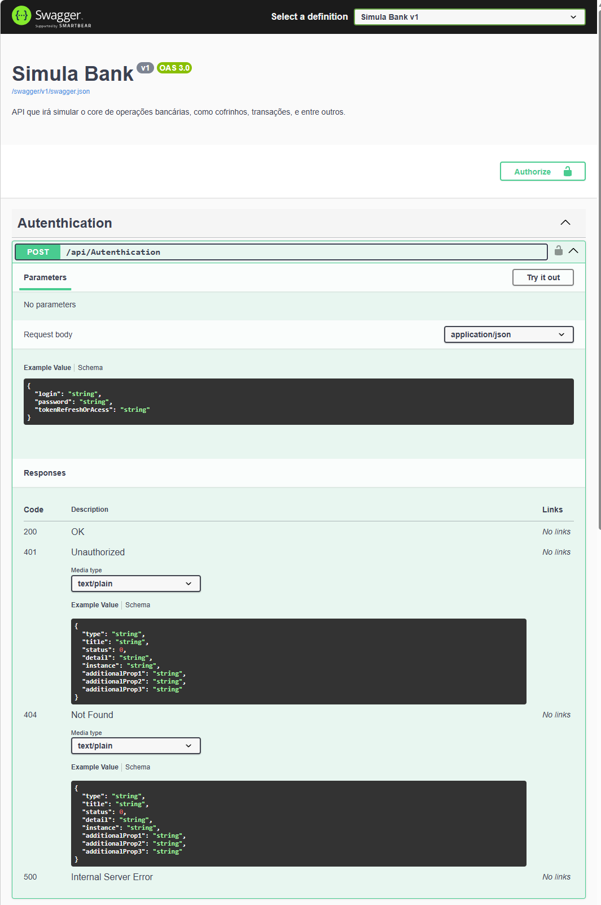
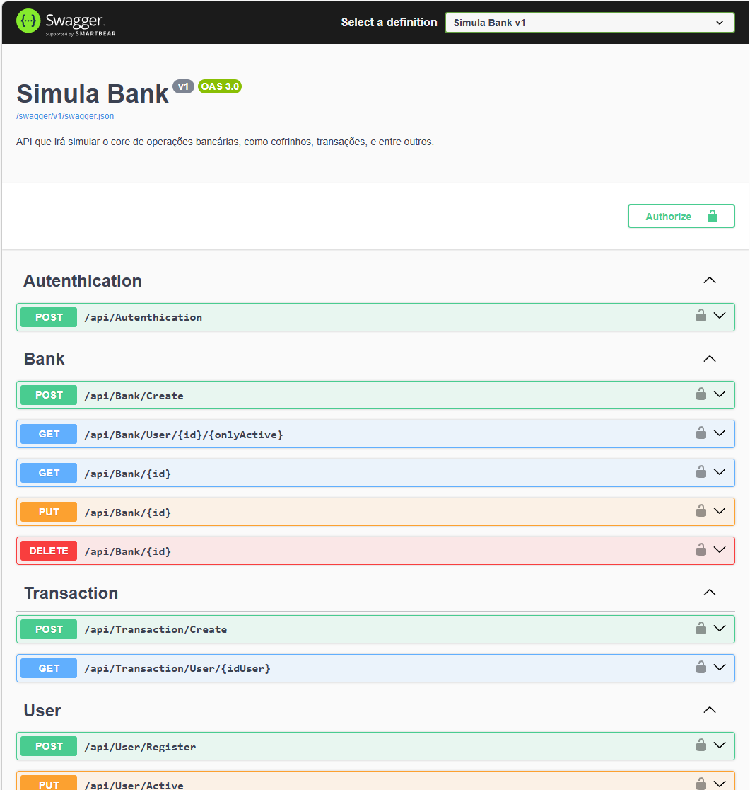

# 🏦 Simula Bank API

## 📌 Visão Geral
O **Simula Bank** é uma API desenvolvida em **.NET 9** que simula serviços de cofrinho de um banco, utilizando **arquitetura hexagonal (Ports and Adapters)**.  
O projeto foi construído com foco em boas práticas de organização, padronização de retornos e extensibilidade. 

---

## ⚙️ Arquitetura
- **Hexagonal (Ports and Adapters)**: separação clara entre domínio, aplicação e infraestrutura.  
- **Swagger**: documenta e expõe todos os endpoints da API. Organizados, separados por temas, e com o objeto de retorno.  
- **Injeção de Dependência**: configurada em arquivo separado e apenas referenciada o apontamento dentro do program `Program.cs`. 
- **Principios**: 
    - SOLID e POO: SOLID sendo uma evolução do POO, esse projeto atende, SRP principio da responsabilidade unica, OCP , DIP inversão de dependencia dependenco apenas de abstrações
    - SoC: Separação entre regras de negócios, infraestrutura, aplicação e apresentação.
    - DRY: Centralização da configuração de DI evitando duplicações.
- **Padrões de Projeto**: Padrão de Repositório, Service Layer, Adapter Pattern, Dependencia de Injeção, entre outros.
- **Banco de Dados**:  
  - SQL Server rodando em **Docker**.  
  - Imagem criada localmente.  
  - Scripts de criação de tabelas disponíveis na pasta `BD`.  
  - Senhas armazenadas em **Hexadecimal** para maior segurança.  

---

## Explicando
### 🔑 Autenticação
- Autenticação via **JWT**.  
- Input: **CPF ou E-mail** + **Senha**.  
- Regras de negócio:
  - Não é permitido CPF e E-mail nulos ao mesmo tempo.  
  - Validação interna para identificar se o input é CPF ou E-mail.  
- Serviço dedicado para:
  - Transformação da senha em **Hexadecimal**.  
  - Geração do **Token JWT**.  

* A API utiliza um **Pattern Result** centralizado para padronizar respostas.  
Esse padrão encapsula:
- Mensagens de erro  
- Status code  
- Dados de sucesso  

Além disso, há um **método de extensão** para `IActionResult` que absorve o `StatusCode` do Pattern, garantindo consistência em todos os endpoints.

---

## 🚀 Implementações
1. Autenticação
2. Registro e Ativação de usuário verificando a existencia, validações internas para identificar o CPF e email.
2. Expansão dos endpoints para operações bancárias adicionais (transferências, consulta, criaçao de caixinha e suas operações).  

---

## 📖 Documentação
- O **Swagger** já está configurado e disponível para explorar todos os endpoints.  
- Exemplos de autenticação e retorno podem ser visualizados diretamente no Swagger UI.  

---

## 🛠️ Tecnologias Utilizadas
- **.NET 9**  
- **SQL Server (Docker)**  
- **Swagger**  
- **Arquitetura Hexagonal**  
- **JWT** para autenticação  
- **Pattern Result** para padronização de respostas  

---

## 📂 Estrutura do Projeto
           
SimulaBank/ 
│── BD/ Scripts de criação de tabelas
│── Core/ Domínio e regras de negócio 
│── Infrastructure/ Adapters e persistência 
│── Application/ Serviços e casos de uso 
│── Api/ Controllers e endpoints 
│── Program.cs Inicialização da aplicação 
│── DependencyInjection/ Configuração de DI 
